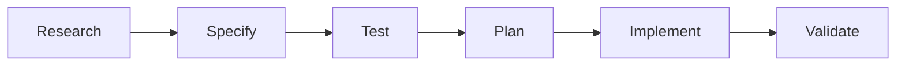

# 🌲 ChocoVine


**AI coding that actually builds what you asked for.**

ChocoVine is a workflow wrapper for **Claude Code** that stops AI from hallucinating. It forces the AI to write a plan and failing tests *before* writing any code. The result? Features that work on the first try, and a codebase that doesn't turn into spaghetti.


[](LICENSE)
[](https://claude.ai)
[](CONTRIBUTING.md)

---

## ⚡️ Why ChocoVine?

We've all been there: You ask an AI to build a feature. It writes 200 lines of code. You run it. It crashes. You spend the next hour prompt-battling to fix it.

**ChocoVine fixes the "Black Box" problem:**

*   **🛡️ No more regression bugs:** We force a TDD (Test Driven Development) workflow. The AI writes the test first. It *cannot* say it's finished until the test passes.
*   **🧠 Infinite Memory:** ChocoVine uses "Sub-agents" to handle research. This keeps your main chat context clean so Claude doesn't "forget" instructions halfway through.
*   **🔎 You stay in control:** You approve the Plan before a single line of code is written.

## 🚀 Getting Started

You need [Claude Code](https://claude.ai/claude-code) installed. Then:

```bash
# 1. Clone the repo
git clone https://github.com/vneseyoungster/Vibe-Starter-Pack.git

# 2. Configure your project (tell ChocoVine about your stack)
# Edit the CLAUDE.md file with your specific setup.
```

## 🎮 How to use

### The Magic Command
For 95% of tasks, you only need one command. ChocoVine handles the research, testing, and coding automatically.

```bash
/start Add a login page with Google OAuth
```

**What happens next?**
1.  🕵️ **Research:** Claude reads your existing code.
2.  🗣️ **Clarify:** It asks you questions (e.g., "Do you want to use Firebase or Auth0?").
3.  📝 **Plan:** It shows you a plan. You type `yes`.
4.  🧪 **Test:** It creates a test file that fails (because the code doesn't exist yet).
5.  ✅ **Code:** It writes the code to pass the test.

---

### 🛠️ Other Useful Commands

While `/start` does it all, sometimes you need specific tools:

| Command | Description | Use Case |
| :--- | :--- | :--- |
| `/quick-fix [error]` | Focused debugging | Fix a specific typo or NullPointer without running a full plan. |
| `/project-scan` | Auto-Documentation | Generate READMEs or API docs by scanning your whole project. |
| `/research:ui [url]` | Figma to Code | Paste a Figma link; get CSS and Design Tokens extracted automatically. |

---

## 🧩 The Workflow (Under the Hood)

For the curious, here is how ChocoVine guarantees quality code. We strictly follow the **RSTPIV** loop:



1.  **Research:** Sub-agents analyze the codebase structure.
2.  **Specify:** Requirements are gathered and confirmed by you.
3.  **Test:** **(The Secret Sauce)** Failing tests are generated based on specs.
4.  **Plan:** Architecture is decided.
5.  **Implement:** Code is written specifically to pass the tests.
6.  **Validate:** Final security and logic checks.

---

## ⚙️ Configuration (`CLAUDE.md`)

To get the best results, help ChocoVine understand your project. Edit `CLAUDE.md` in your root directory:

```markdown
# CLAUDE.md
- **Stack:** React, Tailwind, Node.js, PostgreSQL
- **Build Command:** npm run build
- **Test Command:** npm test
- **Style Guide:** Airbnb standard, use arrow functions
```

## 📄 License

MIT

---

### Advanced Users (Manual Mode)

<details>
<summary>Click to view granular TDD commands</summary>

If you want step-by-step control over the agent loop, you can run phases individually:

- `/research:codebase` - Phase 1: Context gathering
- `/research:feature` - Phase 2: Requirements
- `/research:spec` - Phase 3: Test Specs
- `/generate:tests` - Phase 4: Write Tests
- `/research:plan` - Phase 5: Architecture
- `/execute` - Phase 6: Code
- `/code-check` - Phase 7: Verify

</details>
