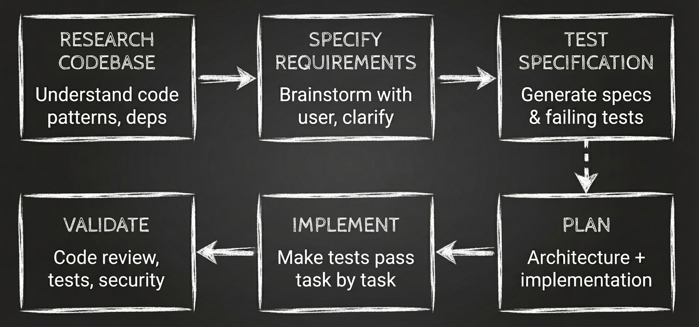

 # 🌲 ChocoVine

**Stop stressing. Start vibing.**
Coding should be as easy (and sweet) as eating a piece of cake.


## The Problem with Vibe Coding

AI coding assistants are powerful, but they come with real challenges:

1. **Prompt engineering is hard** — You spend more time crafting the perfect prompt than building
2. **It's a black box** — You can't see what Claude is doing or catch mistakes early
3. **Context fills up fast** — Quality degrades as conversations grow longer

## Our Solution: TDD-First Workflow

> **R**esearch → **S**pecify → **T**est → **P**lan → **I**mplement → **V**alidate



- **Tests before code** — Write failing tests first, then implement to make them pass
- **Claude asks YOU questions** — No more guessing the perfect prompt
- **Every step is visible** — See the plan before code is written
- **Sub-agents preserve context** — Research runs separately, keeping your main conversation clean
- **Objective verification** — Each task maps to specific tests that must pass

## Getting Started

Simply clone this repository:

```bash
[git clone https://github.com/vneseyoungster/ChocoPine.git]
```

## How to Use It

### The Simple Way

```
/start Add a login page with user authentication
```

Claude handles the full workflow automatically—researching your codebase, asking you clarifying questions, showing you the plan, implementing, and validating.

### Step-by-Step Control (TDD Flow)

```
/research:codebase Add a shopping cart   # Phase 1: Understand existing code
/research:feature Add a shopping cart    # Phase 2: Gather requirements
/research:spec plans/sessions/...        # Phase 3: Generate test specification
/generate:tests plans/sessions/...       # Phase 4: Create failing tests
/research:plan plans/sessions/...        # Phase 5: Architecture & task plan
/execute plans/sessions/...              # Phase 6: Implement (make tests pass)
/code-check plans/sessions/...           # Phase 7: Validate
```

### Quick Fixes

For small, known problems (bug fixes, typos, config changes):

```
/quick-fix Fix the null pointer in UserService.getProfile()
```

Quick-fix uses a streamlined **Research → Summarize → Act** workflow:
- Research agents gather targeted context in parallel (using haiku for speed)
- Summarize-agent consolidates findings (~70% context reduction)
- Main agent implements the fix directly with focused context

For bugs, it follows systematic debugging principles—no fixes without root cause investigation first.

### Project Documentation

For scanning a codebase and generating comprehensive documentation:

```
/project-scan                          # Scan entire codebase
/project-scan ./src                    # Scan specific directory
/project-scan Focus on API docs        # Scan with specific focus
```

Generates layered documentation (architecture, walkthroughs, API reference, setup guides) to help developers onboard quickly.

### UI Design Research

For analyzing Figma designs and extracting implementation specifications:

```
/research:ui https://www.figma.com/file/ABC123/Design?node-id=1-234
```

Exports design assets, analyzes layouts with AI vision, extracts design tokens (colors, typography, spacing), and generates CSS code ready for implementation.

## What Actually Happens

| Command | Phase | What Claude Does | What You Do |
|---------|-------|------------------|-------------|
| `/research:codebase` | **Research** | Explores codebase structure, patterns, dependencies | Wait (sub-agents preserve your context) |
| `/research:feature` | **Specify** | Brainstorms with you, asks clarifying questions | Answer questions, approve requirements |
| `/research:spec` | **Test Spec** | Generates test specification from requirements | Review and approve test cases |
| `/generate:tests` | **Test** | Creates failing test files in your project | Verify tests fail correctly |
| `/research:plan` | **Plan** | Creates architecture + task plan mapped to tests | Approve architecture, then plan |
| `/execute` | **Implement** | Writes code to make tests pass, task by task | Watch progress, intervene if needed |
| `/code-check` | **Validate** | Runs code review, tests, security audit | Confirm everything passes |
| `/quick-fix` | **Research** | Runs targeted research agents in parallel | Wait (haiku agents for speed) |
| `/quick-fix` | **Summarize** | Consolidates findings via summarize-agent | Wait (~70% context reduction) |
| `/quick-fix` | **Fix** | Implements fix directly with focused context | Review changes and commit |
| `/project-scan` | **Understand** | Analyzes git history, structure, patterns, dependencies | Wait (comprehensive analysis) |
| `/project-scan` | **Document** | Generates README, architecture, walkthroughs, API docs | Review generated documentation |
| `/research:ui` | **Extract** | Exports design assets from Figma API | Provide Figma URL and access token |
| `/research:ui` | **Analyze** | Analyzes layout, components, design tokens with AI vision | Wait (uses Gemini Vision API) |
| `/research:ui` | **Document** | Generates design specs, CSS code, component docs | Review design documentation |

## Why This Works

- **TDD prevents bugs** — Tests define expected behavior BEFORE implementation
- **No more prompt guessing** — The questioning phase extracts what you actually need
- **No more confusion** — Every phase produces visible artifacts in `plans/sessions/`
- **No more context degradation** — Sub-agents keep your main context clean
- **No more surprises** — You approve the plan before implementation begins
- **Objective completion** — Each task is verified by specific tests passing

## Commands Reference

### Full Workflow
| Command | Purpose | When to Use |
|---------|---------|-------------|
| `/start [task]` | Full TDD workflow | Most features - runs all phases automatically |

### TDD Flow (Step-by-Step)
| Command | Purpose | When to Use |
|---------|---------|-------------|
| `/research:codebase [task]` | Phase 1: Codebase research | First step - understand existing code |
| `/research:feature [task]` | Phase 2: Requirements | After codebase research, gather requirements |
| `/research:spec [session]` | Phase 3: Test specification | Generate test specs from requirements |
| `/generate:tests [session]` | Phase 4: Create tests | Generate failing test files |
| `/research:plan [session]` | Phase 5: Architecture & plan | Design solution to make tests pass |
| `/execute [session]` | Phase 6: Implementation | Make tests pass, task by task |
| `/code-check [session]` | Phase 7: Validation | Code review, tests, security audit |

### Standalone Commands
| Command | Purpose | When to Use |
|---------|---------|-------------|
| `/quick-fix [problem]` | Fast fixes | Bug fixes, typos, config changes (<10 lines) |
| `/project-scan [target]` | Project documentation | Scan codebase and generate documentation |
| `/research:ui [figma-url]` | UI design analysis | Analyze Figma designs and extract specs |
| `/research:docs [topic]` | External documentation | Research libraries, frameworks, APIs |
| `/initialize [name]` | New project setup | Initialize a new project with guided wizard |

## Configuration

Edit `CLAUDE.md` to tell Claude about your project:
- Tech stack (language, framework, database)
- Build commands
- Code conventions
- Directory structure

The more context you provide upfront, the better the results.

## Requirements

- Claude Code version 1.0.124+
- Sub-agent support enabled

## Documentation

- [Commands Guide](.claude/commands/README.md)
- [Project Configuration](CLAUDE.md)

## License

MIT

---

Built for [Claude Code](https://claude.ai/claude-code)
