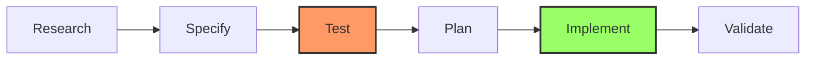

<div align="center">


# ChocoVine

**Stop prompting. Start building.**

A workflow wrapper for **Claude Code** that forces AI to think before it types.
<br />

[](LICENSE)
[](https://claude.ai)
[](CONTRIBUTING.md)

[Getting Started](#-getting-started) • [The Workflow](#-the-workflow) • [Commands](#-command-reference)

</div>

---

## ⚡️ The Problem
We've all been there: You ask an AI to build a feature. It blindly writes 200 lines of code. You run it. It crashes. You spend the next hour prompt-battling to fix it.

## 🌲 The Solution
**ChocoVine turns "Vibes Coding" into Engineering.**
It stops hallucinations by enforcing a strict **Research → Test → Code** loop.

*   🛡️ **TDD Guardrails:** The AI writes a failing test first. It *cannot* mark a task complete until that test passes.
*   🧠 **Infinite Context:** Uses sub-agents to read your entire codebase without clogging up the chat memory.
*   🔎 **You are the Architect:** You approve the Plan before a single line of code is written.
*   📈 **Scales with You:** Optimized for mid-to-large codebases where "context limits" usually break other tools.

---

## 🚀 Getting Started

You need [Claude Code](https://claude.ai/claude-code) installed.

### 1. Installation

#### Option A: npx (Recommended)

```bash
# Navigate to your project
cd your-project

# Install ChocoVine
npx chocovine init
```

#### Option B: Global Install

```bash
# Install globally
npm install -g chocovine

# Then in any project
chocovine init
```

#### Option C: Clone the Repo

```bash
# Clone and copy manually
git clone https://github.com/vneseyoungster/ChocoVine.git
cp -r ChocoVine/.claude your-project/
```

### 2. Configuration

Edit the generated `CLAUDE.md` with your project details:

```bash
# Tell ChocoVine your stack (React, Python, etc.)
nano CLAUDE.md
```

### 3. Initialization

Tell ChocoVine to scan your project so it understands your architecture patterns.

```bash
# If you are starting a NEW project from scratch:
/initialize my-new-app

# If you are adding ChocoVine to an EXISTING codebase:
/project-scan
```

---

## 🎮 How to Use

### The Magic Command (`/start`)

For 95% of tasks, you only need one command. ChocoVine handles the research, testing, and coding automatically.

```bash
/start Add a login page with Google OAuth
```

**What happens next?**
1.  🕵️ **Research:** Claude reads your existing code (auth providers, database schema).
2.  🗣️ **Clarify:** It asks you specific questions (e.g., "Do you want to use Firebase or Auth0?").
3.  📝 **Plan:** It presents a plan. You type `yes`.
4.  🧪 **Test:** It creates a test file that fails (because the code doesn't exist yet).
5.  ✅ **Code:** It writes the code specifically to pass that test.

---

## 🧩 The Architecture

How do we guarantee code quality? We strictly follow the **RSTPIV** loop. This prevents the "spaghetti code" effect common with other AI tools.



---

## 📚 Command Reference

### Essentials
| Command | Description |
| :--- | :--- |
| `/start [task]` | **The Main Event.** Runs the full TDD loop automatically. |
| `/quick-fix [error]` | **Bug Hunter.** Fixes typos, null pointers, or small bugs without a full plan. |
| `/project-scan` | **Documentarian.** Scans your project and generates/updates READMEs and Arch docs. |

### Research & Design
| Command | Description |
| :--- | :--- |
| `/research:ui [figma-url]` | **Figma → Code.** Extracts tokens, CSS, and layout from a Figma URL. |
| `/research:codebase` | **Context.** "How does the auth middleware work?" |
| `/research:docs` | **External Knowledge.** Reads documentation for libraries you are using. |

<details>
<summary><b>🛠 Advanced: Manual Phase Control</b> (Click to expand)</summary>
<br />
If you want granular control over the agent loop, you can run specific phases individually:

| Phase | Command | Purpose |
| :--- | :--- | :--- |
| 1 | `/research:feature` | Collaborative requirements gathering |
| 2 | `/research:spec` | Generate test specifications |
| 3 | `/generate:tests` | Write the failing tests |
| 4 | `/research:plan` | Create the implementation plan |
| 5 | `/execute` | Write code to pass tests |
| 6 | `/code-check` | Final validation & security audit |

</details>

---

## ⚙️ Configuration

To get the best results, your `CLAUDE.md` needs to be accurate. This is the "System Prompt" for your project.

```markdown
# CLAUDE.md Example
- **Stack:** Next.js 14, Tailwind, Supabase, TypeScript
- **Build Command:** npm run build
- **Test Command:** npm test
- **Conventions:** Use arrow functions, no 'any' types, prefer functional components.
```

## 📄 License

MIT © 