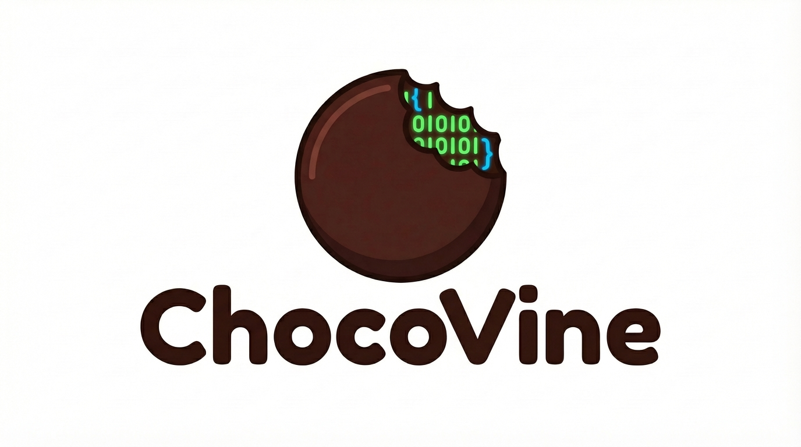

<div align="center">



# ChocoVine

**Stop prompting. Start building.**

A workflow wrapper for **Claude Code** that forces AI to think before it types.
<br />

[](LICENSE)
[](https://claude.ai)
[](CONTRIBUTING.md)

[Getting Started](#-getting-started) • [The Workflow](#-the-workflow) • [Commands](#-command-reference)

</div>

---

## ⚡️ The Problem
We've all been there: You ask an AI to build a feature. It blindly writes 200 lines of code. You run it. It crashes. You spend the next hour prompt-battling to fix it.

## 🌲 The Solution
**ChocoVine turns "Vibes Coding" into Engineering.**
It stops hallucinations by enforcing a strict **Plan → Test → Build** loop.

*   🛡️ **TDD Guardrails:** The AI writes a failing test first. It *cannot* mark a task complete until that test passes.
*   🧠 **Infinite Context:** Uses sub-agents to read your entire codebase without clogging up the chat memory.
*   🔎 **You are the Architect:** You approve the Plan before a single line of code is written.
*   📈 **Scales with You:** Optimized for mid-to-large codebases where "context limits" usually break other tools.

---

## 🚀 Getting Started

You need [Claude Code](https://claude.ai/claude-code) installed.

### 1. Installation

#### Option A: npx (Recommended)

```bash
# Navigate to your project
cd your-project

# Install ChocoVine directly from GitHub
npx github:vneseyoungster/ChocoVine init
```

#### Option B: Clone the Repo

```bash
# Clone and copy manually
git clone https://github.com/vneseyoungster/ChocoVine.git
cp -r ChocoVine/.claude your-project/
```

### 2. Configuration

Edit the generated `CLAUDE.md` with your project details:

```bash
# Tell ChocoVine your stack (React, Python, etc.)
nano CLAUDE.md
```

### 3. Initialization

Tell ChocoVine to scan your project so it understands your architecture patterns.

```bash
# /cv:init auto-detects: new project wizard OR existing project scan
/cv:init
```

---

## 🎮 How to Use

### The Core Workflow

For most tasks, follow this flow. You control each phase with explicit approval gates.

```bash
/cv:research Add a login page with Google OAuth
/cv:plan
/cv:build
npm test
/cv:review
```

**What happens at each step?**
1. **Research:** Claude maps your codebase, identifies patterns, asks clarifying questions.
2. **Plan:** Presents architecture and tasks. You approve before any code is written.
3. **Build:** Implements the approved plan with inline validation.
4. **Test:** You run tests manually to verify.
5. **Review:** Code quality, security audit, and coverage check.

---

## 🧩 The Workflow

How do we guarantee code quality? We strictly follow the **Research → Plan → Build → Review** loop. This prevents the "spaghetti code" effect common with other AI tools.

```mermaid
graph LR
    A[/cv:research] --> B[/cv:plan]
    B --> C[/cv:build]
    C --> D[test]
    D --> E[/cv:review]

    subgraph Research
    A1[Scan] --> A2[Clarify]
    A2 --> A3[Requirements]
    end

    subgraph Plan
    B1[Architecture] --> B2[Tasks]
    B2 --> B3[Test Specs]
    end

    subgraph Build
    C1[Implement] --> C2[Validate]
    end

    style A3 fill:#f96,stroke:#333,stroke-width:2px
    style C1 fill:#9f6,stroke:#333,stroke-width:2px
```

---

## 📚 Command Reference

### Core Commands
| Command | Description |
| :--- | :--- |
| `/cv:research [topic]` | **Research.** Gather context, requirements, resolve conflicts. |
| `/cv:plan [session]` | **Plan.** Architecture, tasks, test specs (from research). |
| `/cv:build [session]` | **Build.** Implement tasks, validate, generate test instructions. |
| `/cv:review [session]` | **Review.** Code quality, security audit, coverage check. |
| `/cv:fix [error]` | **Fix.** Systematic debugging or quick fixes. |
| `/cv:refactor [type]` | **Refactor.** Dead code cleanup, rename/move, extract, or general. |
| `/cv:init` | **Setup.** New project wizard OR scan existing codebase. |

### Research Modes
| Command | Description |
| :--- | :--- |
| `/cv:research [topic]` | **Auto-routes.** Detects Figma URLs, docs, or general topics. |
| `/cv:research --ui [figma-url]` | **Figma to Code.** Extracts tokens, CSS, and layout. |
| `/cv:research --docs [library]` | **External Knowledge.** Reads library documentation. |

<details>
<summary><b>🔄 Migration from v2.x</b> (Click to expand)</summary>
<br />
Commands now use the `cv:` prefix for clarity:

| Old Command | New Equivalent |
| :--- | :--- |
| `/start [task]` | `/cv:research` → `/cv:plan` → `/cv:build` → `/cv:review` |
| `/init` | `/cv:init` |
| `/plan` | `/cv:plan` |
| `/build` | `/cv:build` |
| `/fix` | `/cv:fix` |
| `/refactor` | `/cv:refactor` |
| `/research` | `/cv:research` |

**Why the change?**
- Namespace isolation: `cv:` prefix prevents conflicts with other tools
- Explicit workflow: each command has one job with approval gates
- Better visibility: clear separation of concerns

</details>

---

## ⚙️ Configuration

To get the best results, your `CLAUDE.md` needs to be accurate. This is the "System Prompt" for your project.

```markdown
# CLAUDE.md Example
- **Stack:** Next.js 14, Tailwind, Supabase, TypeScript
- **Build Command:** npm run build
- **Test Command:** npm test
- **Conventions:** Use arrow functions, no 'any' types, prefer functional components.
```

## 📄 License

MIT © 